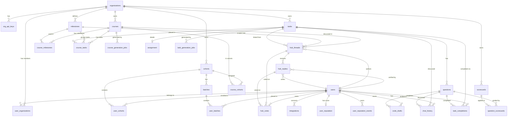

# SensAI — Complete Database Schema Design
> **Stack:** SQLite (aiosqlite) · Python / Pydantic v2 · BigQuery mirror (read-only analytics)  
> **Pattern:** Soft-delete via `deleted_at DATETIME NULL` on every table. All timestamps UTC.  
> **Last updated:** 2026-04-10

---

## Table of Contents
1. [Design Principles](#1-design-principles)
2. [Full Entity-Relationship Diagram](#2-full-entity-relationship-diagram)
3. [Existing Schema (25 tables)](#3-existing-schema-25-tables)
4. [New Schema — Hubs, Reputation & Knowledge Graphs (5 tables + FTS)](#4-new-schema--hubs-reputation--knowledge-graphs)
5. [Index Reference](#5-index-reference)
6. [Query Patterns & Index Usage](#6-query-patterns--index-usage)
7. [Migration DDL](#7-migration-ddl)
8. [Pydantic Model Additions](#8-pydantic-model-additions)

---

## 1. Design Principles

| Principle | How it is applied |
|---|---|
| **Soft delete everywhere** | `deleted_at DATETIME` on every table; all queries filter `WHERE deleted_at IS NULL` |
| **Denormalized counters** | `hub_threads.reply_count`, `verified_reply_count`, `upvotes` are kept in sync via application logic on every write — eliminates expensive `COUNT(*)` joins on hot list endpoints |
| **Composite index shapes match query shapes** | Every index is designed to cover a specific `WHERE … ORDER BY …` clause used by a named API endpoint |
| **FTS5 for duplicate detection** | A virtual table mirrors `hub_threads(title, content)` for sub-millisecond full-text search |
| **Append-only audit log** | `user_reputation_events` is never updated, only inserted — gives a full ledger for score reconstruction |
| **Consistent trigger pattern** | `updated_at` is maintained by an `AFTER UPDATE` trigger, identical to the existing `assignment` and `integrations` tables |
| **One vote per user per item** | `UNIQUE(user_id, item_type, item_id)` on `hub_votes` enforces idempotency at the DB level |
| **Modular table groups** | Tables are grouped by domain (Identity, Organisation, Learning, Hub, Reputation) so new domains can be added without touching existing groups |

---

## 2. Full Entity-Relationship Diagram



---

## 3. Existing Schema (25 tables)

### Domain A — Identity & Access

---

#### `organizations`
Primary tenant. Every piece of content is scoped to an org.

```sql
CREATE TABLE organizations (
    id                  INTEGER PRIMARY KEY AUTOINCREMENT,
    slug                TEXT    NOT NULL UNIQUE,          -- URL-safe identifier
    name                TEXT    NOT NULL,
    default_logo_color  TEXT,
    created_at          DATETIME DEFAULT CURRENT_TIMESTAMP,
    updated_at          DATETIME DEFAULT CURRENT_TIMESTAMP,
    deleted_at          DATETIME
);

CREATE INDEX idx_org_slug ON organizations (slug);
```

| Column | Type | Notes |
|---|---|---|
| `id` | INTEGER PK | Auto-increment surrogate key |
| `slug` | TEXT UNIQUE | URL-safe org identifier, used in frontend routing |
| `name` | TEXT | Display name |
| `default_logo_color` | TEXT | Hex color for avatar fallback |

---

#### `org_api_keys`
Hashed API keys issued to organisations for server-to-server calls.

```sql
CREATE TABLE org_api_keys (
    id          INTEGER PRIMARY KEY AUTOINCREMENT,
    org_id      INTEGER NOT NULL,
    hashed_key  TEXT    NOT NULL UNIQUE,
    created_at  DATETIME DEFAULT CURRENT_TIMESTAMP,
    updated_at  DATETIME DEFAULT CURRENT_TIMESTAMP,
    deleted_at  DATETIME,
    FOREIGN KEY (org_id) REFERENCES organizations(id) ON DELETE CASCADE
);

CREATE INDEX idx_org_api_key_org_id    ON org_api_keys (org_id);
CREATE INDEX idx_org_api_key_hashed_key ON org_api_keys (hashed_key);
```

---

#### `users`
Platform user. Auth is delegated to Google OAuth; this table stores the resolved profile.

```sql
CREATE TABLE users (
    id                  INTEGER PRIMARY KEY AUTOINCREMENT,
    email               TEXT    NOT NULL UNIQUE,
    first_name          TEXT,
    middle_name         TEXT,
    last_name           TEXT,
    default_dp_color    TEXT,                            -- avatar fallback color
    created_at          DATETIME DEFAULT CURRENT_TIMESTAMP,
    updated_at          DATETIME DEFAULT CURRENT_TIMESTAMP,
    deleted_at          DATETIME
);
```

---

#### `user_organizations`
M:N join — a user may belong to multiple orgs with a single role per org.

```sql
CREATE TABLE user_organizations (
    id          INTEGER PRIMARY KEY AUTOINCREMENT,
    user_id     INTEGER NOT NULL,
    org_id      INTEGER NOT NULL,
    role        TEXT    NOT NULL,                        -- 'admin' | 'learner' | 'mentor'
    created_at  DATETIME DEFAULT CURRENT_TIMESTAMP,
    updated_at  DATETIME DEFAULT CURRENT_TIMESTAMP,
    deleted_at  DATETIME,
    UNIQUE (user_id, org_id),
    FOREIGN KEY (user_id) REFERENCES users(id)          ON DELETE CASCADE,
    FOREIGN KEY (org_id)  REFERENCES organizations(id)  ON DELETE CASCADE
);

CREATE INDEX idx_user_org_user_id ON user_organizations (user_id);
CREATE INDEX idx_user_org_org_id  ON user_organizations (org_id);
```

---

### Domain B — Cohorts & Batches

---

#### `cohorts`
A group of learners within an org. Courses are assigned to cohorts.

```sql
CREATE TABLE cohorts (
    id          INTEGER PRIMARY KEY AUTOINCREMENT,
    name        TEXT    NOT NULL,
    org_id      INTEGER NOT NULL,
    created_at  DATETIME DEFAULT CURRENT_TIMESTAMP,
    updated_at  DATETIME DEFAULT CURRENT_TIMESTAMP,
    deleted_at  DATETIME,
    FOREIGN KEY (org_id) REFERENCES organizations(id) ON DELETE CASCADE
);

CREATE INDEX idx_cohort_org_id ON cohorts (org_id);
```

---

#### `user_cohorts`
M:N join — a user may be enrolled in multiple cohorts with a role per cohort.

```sql
CREATE TABLE user_cohorts (
    id          INTEGER PRIMARY KEY AUTOINCREMENT,
    user_id     INTEGER NOT NULL,
    cohort_id   INTEGER NOT NULL,
    role        TEXT    NOT NULL,                        -- 'learner' | 'mentor'
    joined_at   DATETIME DEFAULT CURRENT_TIMESTAMP,
    updated_at  DATETIME DEFAULT CURRENT_TIMESTAMP,
    deleted_at  DATETIME,
    UNIQUE (user_id, cohort_id),
    FOREIGN KEY (user_id)   REFERENCES users(id)   ON DELETE CASCADE,
    FOREIGN KEY (cohort_id) REFERENCES cohorts(id) ON DELETE CASCADE
);

CREATE INDEX idx_user_cohort_user_id   ON user_cohorts (user_id);
CREATE INDEX idx_user_cohort_cohort_id ON user_cohorts (cohort_id);
```

---

#### `batches`
Sub-group within a cohort. Used to split large cohorts into smaller working groups.

```sql
CREATE TABLE batches (
    id          INTEGER PRIMARY KEY AUTOINCREMENT,
    name        TEXT    NOT NULL,
    cohort_id   INTEGER NOT NULL,
    created_at  DATETIME DEFAULT CURRENT_TIMESTAMP,
    updated_at  DATETIME DEFAULT CURRENT_TIMESTAMP,
    deleted_at  DATETIME,
    FOREIGN KEY (cohort_id) REFERENCES cohorts(id) ON DELETE CASCADE
);

CREATE INDEX idx_batch_cohort_id ON batches (cohort_id);
```

---

#### `user_batches`
M:N join — user → batch placement.

```sql
CREATE TABLE user_batches (
    id          INTEGER PRIMARY KEY AUTOINCREMENT,
    user_id     INTEGER NOT NULL,
    batch_id    INTEGER NOT NULL,
    created_at  DATETIME DEFAULT CURRENT_TIMESTAMP,
    updated_at  DATETIME DEFAULT CURRENT_TIMESTAMP,
    deleted_at  DATETIME,
    UNIQUE (user_id, batch_id),
    FOREIGN KEY (user_id)  REFERENCES users(id)   ON DELETE CASCADE,
    FOREIGN KEY (batch_id) REFERENCES batches(id) ON DELETE CASCADE
);

CREATE INDEX idx_user_batch_user_id  ON user_batches (user_id);
CREATE INDEX idx_user_batch_batch_id ON user_batches (batch_id);
```

---

### Domain C — Learning Content

---

#### `courses`
Top-level learning product. Owned by an org, distributed to cohorts.

```sql
CREATE TABLE courses (
    id          INTEGER PRIMARY KEY AUTOINCREMENT,
    org_id      INTEGER NOT NULL,
    name        TEXT    NOT NULL,
    created_at  DATETIME DEFAULT CURRENT_TIMESTAMP,
    updated_at  DATETIME DEFAULT CURRENT_TIMESTAMP,
    deleted_at  DATETIME,
    FOREIGN KEY (org_id) REFERENCES organizations(id) ON DELETE CASCADE
);

CREATE INDEX idx_course_org_id ON courses (org_id);
```

---

#### `course_cohorts`
M:N join — courses assigned to cohorts, with optional drip publishing config.

```sql
CREATE TABLE course_cohorts (
    id               INTEGER PRIMARY KEY AUTOINCREMENT,
    course_id        INTEGER NOT NULL,
    cohort_id        INTEGER NOT NULL,
    is_drip_enabled  BOOLEAN DEFAULT FALSE,
    frequency_value  INTEGER,
    frequency_unit   TEXT,
    publish_at       DATETIME,
    created_at       DATETIME DEFAULT CURRENT_TIMESTAMP,
    updated_at       DATETIME DEFAULT CURRENT_TIMESTAMP,
    deleted_at       DATETIME,
    UNIQUE (course_id, cohort_id),
    FOREIGN KEY (course_id)  REFERENCES courses(id)  ON DELETE CASCADE,
    FOREIGN KEY (cohort_id)  REFERENCES cohorts(id)  ON DELETE CASCADE
);

CREATE INDEX idx_course_cohort_course_id ON course_cohorts (course_id);
CREATE INDEX idx_course_cohort_cohort_id ON course_cohorts (cohort_id);
```

| Column | Notes |
|---|---|
| `is_drip_enabled` | When true, tasks unlock progressively |
| `frequency_value` + `frequency_unit` | e.g. `7` + `'days'` = unlock weekly |
| `publish_at` | Absolute datetime for first drip unlock |

---

#### `milestones`
A named module/chapter defined at org level, reused across courses.

```sql
CREATE TABLE milestones (
    id          INTEGER PRIMARY KEY AUTOINCREMENT,
    org_id      INTEGER NOT NULL,
    name        TEXT    NOT NULL,
    color       TEXT,                                    -- UI accent color
    created_at  DATETIME DEFAULT CURRENT_TIMESTAMP,
    updated_at  DATETIME DEFAULT CURRENT_TIMESTAMP,
    deleted_at  DATETIME,
    FOREIGN KEY (org_id) REFERENCES organizations(id) ON DELETE CASCADE
);

CREATE INDEX idx_milestone_org_id ON milestones (org_id);
```

> **Architecture note:** A Hub is not a separate table — it is a filtered view of `hub_threads` WHERE `milestone_id = ?` AND `course_id = ?`. The `milestones` table is the source of truth for Hub identity.

---

#### `course_milestones`
Ordered M:N join — places milestones into courses with a display ordering.

```sql
CREATE TABLE course_milestones (
    id           INTEGER PRIMARY KEY AUTOINCREMENT,
    course_id    INTEGER NOT NULL,
    milestone_id INTEGER,
    ordering     INTEGER NOT NULL,
    created_at   DATETIME DEFAULT CURRENT_TIMESTAMP,
    updated_at   DATETIME DEFAULT CURRENT_TIMESTAMP,
    deleted_at   DATETIME,
    UNIQUE (course_id, milestone_id),
    FOREIGN KEY (course_id)    REFERENCES courses(id)    ON DELETE CASCADE,
    FOREIGN KEY (milestone_id) REFERENCES milestones(id) ON DELETE CASCADE
);

CREATE INDEX idx_course_milestone_course_id    ON course_milestones (course_id);
CREATE INDEX idx_course_milestone_milestone_id ON course_milestones (milestone_id);
```

---

#### `tasks`
A single learning unit (quiz, learning material, or assignment). Reusable across courses.

```sql
CREATE TABLE tasks (
    id                   INTEGER PRIMARY KEY AUTOINCREMENT,
    org_id               INTEGER NOT NULL,
    type                 TEXT    NOT NULL,               -- 'quiz' | 'learning_material' | 'assignment'
    blocks               TEXT,                           -- JSON (BlockNote content)
    title                TEXT    NOT NULL,
    status               TEXT    NOT NULL,               -- 'draft' | 'published'
    scheduled_publish_at DATETIME,
    created_at           DATETIME DEFAULT CURRENT_TIMESTAMP,
    updated_at           DATETIME DEFAULT CURRENT_TIMESTAMP,
    deleted_at           DATETIME,
    FOREIGN KEY (org_id) REFERENCES organizations(id) ON DELETE CASCADE
);

CREATE INDEX idx_task_org_id ON tasks (org_id);
```

---

#### `course_tasks`
Ordered placement of a task within a course, optionally grouped under a milestone.

```sql
CREATE TABLE course_tasks (
    id           INTEGER PRIMARY KEY AUTOINCREMENT,
    task_id      INTEGER NOT NULL,
    course_id    INTEGER NOT NULL,
    milestone_id INTEGER,
    ordering     INTEGER NOT NULL,
    created_at   DATETIME DEFAULT CURRENT_TIMESTAMP,
    updated_at   DATETIME DEFAULT CURRENT_TIMESTAMP,
    deleted_at   DATETIME,
    UNIQUE (task_id, course_id),
    FOREIGN KEY (task_id)      REFERENCES tasks(id)      ON DELETE CASCADE,
    FOREIGN KEY (course_id)    REFERENCES courses(id)    ON DELETE CASCADE,
    FOREIGN KEY (milestone_id) REFERENCES milestones(id) ON DELETE CASCADE
);

CREATE INDEX idx_course_task_task_id      ON course_tasks (task_id);
CREATE INDEX idx_course_task_course_id    ON course_tasks (course_id);
CREATE INDEX idx_course_task_milestone_id ON course_tasks (milestone_id);
```

---

#### `questions`
Individual questions belonging to a quiz task.

```sql
CREATE TABLE questions (
    id                INTEGER PRIMARY KEY AUTOINCREMENT,
    task_id           INTEGER NOT NULL,
    type              TEXT    NOT NULL,                  -- 'subjective' | 'objective'
    blocks            TEXT,                              -- JSON question body
    answer            TEXT,                              -- JSON model answer
    input_type        TEXT    NOT NULL,                  -- 'code' | 'text' | 'audio'
    coding_language   TEXT,
    generation_model  TEXT,
    response_type     TEXT    NOT NULL,                  -- 'chat' | 'exam'
    position          INTEGER NOT NULL,
    max_attempts      INTEGER,
    is_feedback_shown BOOLEAN NOT NULL,
    context           TEXT,                              -- JSON AI grading context
    title             TEXT    NOT NULL,
    settings          JSON,
    created_at        DATETIME DEFAULT CURRENT_TIMESTAMP,
    updated_at        DATETIME DEFAULT CURRENT_TIMESTAMP,
    deleted_at        DATETIME,
    FOREIGN KEY (task_id) REFERENCES tasks(id) ON DELETE CASCADE
);

CREATE INDEX idx_question_task_id ON questions (task_id);
```

---

#### `assignment`
1:1 extension of a task of type `assignment`. Stores assignment-specific body and evaluation config.

```sql
CREATE TABLE assignment (
    id                  INTEGER PRIMARY KEY AUTOINCREMENT,
    task_id             INTEGER NOT NULL UNIQUE,
    blocks              TEXT,                            -- JSON assignment body
    input_type          TEXT    NOT NULL,
    response_type       TEXT,
    context             TEXT,
    evaluation_criteria TEXT,                            -- JSON scorecard criteria
    max_attempts        INTEGER,
    settings            TEXT,
    created_at          DATETIME DEFAULT CURRENT_TIMESTAMP,
    updated_at          DATETIME DEFAULT CURRENT_TIMESTAMP,
    deleted_at          DATETIME,
    FOREIGN KEY (task_id) REFERENCES tasks(id) ON DELETE CASCADE
);

CREATE INDEX idx_assignment_task_id ON assignment (task_id);

CREATE TRIGGER set_updated_at_assignment
AFTER UPDATE ON assignment FOR EACH ROW
BEGIN
    UPDATE assignment SET updated_at = CURRENT_TIMESTAMP WHERE id = NEW.id;
END;
```

---

#### `scorecards`
Reusable evaluation rubrics defined at org level.

```sql
CREATE TABLE scorecards (
    id          INTEGER PRIMARY KEY AUTOINCREMENT,
    org_id      INTEGER NOT NULL,
    title       TEXT    NOT NULL,
    criteria    TEXT    NOT NULL,                        -- JSON array of ScorecardCriterion
    status      TEXT,                                    -- 'draft' | 'published'
    created_at  DATETIME DEFAULT CURRENT_TIMESTAMP,
    updated_at  DATETIME DEFAULT CURRENT_TIMESTAMP,
    deleted_at  DATETIME,
    FOREIGN KEY (org_id) REFERENCES organizations(id) ON DELETE CASCADE
);

CREATE INDEX idx_scorecard_org_id ON scorecards (org_id);
```

---

#### `question_scorecards`
M:N join — attaches a scorecard to a question.

```sql
CREATE TABLE question_scorecards (
    id           INTEGER PRIMARY KEY AUTOINCREMENT,
    question_id  INTEGER NOT NULL,
    scorecard_id INTEGER NOT NULL,
    created_at   DATETIME DEFAULT CURRENT_TIMESTAMP,
    updated_at   DATETIME DEFAULT CURRENT_TIMESTAMP,
    deleted_at   DATETIME,
    UNIQUE (question_id, scorecard_id),
    FOREIGN KEY (question_id)  REFERENCES questions(id)  ON DELETE CASCADE,
    FOREIGN KEY (scorecard_id) REFERENCES scorecards(id) ON DELETE CASCADE
);

CREATE INDEX idx_question_scorecard_question_id  ON question_scorecards (question_id);
CREATE INDEX idx_question_scorecard_scorecard_id ON question_scorecards (scorecard_id);
```

---

#### `chat_history`
Stores every AI ↔ learner message for a question or task session.

```sql
CREATE TABLE chat_history (
    id            INTEGER PRIMARY KEY AUTOINCREMENT,
    user_id       INTEGER NOT NULL,
    question_id   INTEGER,
    task_id       INTEGER,
    role          TEXT    NOT NULL,                      -- 'user' | 'assistant'
    content       TEXT,
    response_type TEXT,                                  -- 'text' | 'code' | 'audio' | 'file'
    created_at    DATETIME DEFAULT CURRENT_TIMESTAMP,
    updated_at    DATETIME DEFAULT CURRENT_TIMESTAMP,
    deleted_at    DATETIME,
    FOREIGN KEY (question_id) REFERENCES questions(id),
    FOREIGN KEY (task_id)     REFERENCES tasks(id),
    FOREIGN KEY (user_id)     REFERENCES users(id) ON DELETE CASCADE
);

CREATE INDEX idx_chat_history_user_id     ON chat_history (user_id);
CREATE INDEX idx_chat_history_task_id     ON chat_history (task_id);
CREATE INDEX idx_chat_history_question_id ON chat_history (question_id);
```

---

#### `task_completions`
Records when a user has completed a task or answered a question.

```sql
CREATE TABLE task_completions (
    id          INTEGER PRIMARY KEY AUTOINCREMENT,
    user_id     INTEGER NOT NULL,
    task_id     INTEGER,
    question_id INTEGER,
    created_at  DATETIME DEFAULT CURRENT_TIMESTAMP,
    updated_at  DATETIME DEFAULT CURRENT_TIMESTAMP,
    deleted_at  DATETIME,
    UNIQUE (user_id, task_id),
    UNIQUE (user_id, question_id),
    FOREIGN KEY (user_id)     REFERENCES users(id)     ON DELETE CASCADE,
    FOREIGN KEY (task_id)     REFERENCES tasks(id)     ON DELETE CASCADE,
    FOREIGN KEY (question_id) REFERENCES questions(id) ON DELETE CASCADE
);

CREATE INDEX idx_task_completion_user_id     ON task_completions (user_id);
CREATE INDEX idx_task_completion_task_id     ON task_completions (task_id);
CREATE INDEX idx_task_completion_question_id ON task_completions (question_id);
```

---

#### `code_drafts`
Auto-saves learner code per question so progress is not lost on page refresh.

```sql
CREATE TABLE code_drafts (
    id          INTEGER PRIMARY KEY AUTOINCREMENT,
    user_id     INTEGER NOT NULL,
    question_id INTEGER NOT NULL,
    code        TEXT    NOT NULL,                        -- JSON array of LanguageCodeDraft
    created_at  DATETIME DEFAULT CURRENT_TIMESTAMP,
    updated_at  DATETIME DEFAULT CURRENT_TIMESTAMP,
    deleted_at  DATETIME,
    UNIQUE (user_id, question_id),
    FOREIGN KEY (user_id)     REFERENCES users(id)     ON DELETE CASCADE,
    FOREIGN KEY (question_id) REFERENCES questions(id) ON DELETE CASCADE
);

CREATE INDEX idx_code_drafts_user_id     ON code_drafts (user_id);
CREATE INDEX idx_code_drafts_question_id ON code_drafts (question_id);
```

---

### Domain D — Jobs & System

---

#### `course_generation_jobs`
Tracks async AI course-generation jobs.

```sql
CREATE TABLE course_generation_jobs (
    id          INTEGER PRIMARY KEY AUTOINCREMENT,
    uuid        TEXT    NOT NULL,
    course_id   INTEGER NOT NULL,
    status      TEXT    NOT NULL,                        -- 'started' | 'pending' | 'completed' | 'failed'
    job_details TEXT,
    created_at  DATETIME DEFAULT CURRENT_TIMESTAMP,
    updated_at  DATETIME DEFAULT CURRENT_TIMESTAMP,
    deleted_at  DATETIME,
    FOREIGN KEY (course_id) REFERENCES courses(id) ON DELETE CASCADE
);

CREATE INDEX idx_course_generation_job_course_id ON course_generation_jobs (course_id);
```

---

#### `task_generation_jobs`
Tracks async AI task/question generation jobs.

```sql
CREATE TABLE task_generation_jobs (
    id          INTEGER PRIMARY KEY AUTOINCREMENT,
    uuid        TEXT    NOT NULL,
    task_id     INTEGER NOT NULL,
    course_id   INTEGER NOT NULL,
    status      TEXT    NOT NULL,                        -- 'started' | 'completed' | 'failed'
    job_details TEXT,
    created_at  DATETIME DEFAULT CURRENT_TIMESTAMP,
    updated_at  DATETIME DEFAULT CURRENT_TIMESTAMP,
    deleted_at  DATETIME,
    FOREIGN KEY (task_id)   REFERENCES tasks(id)   ON DELETE CASCADE,
    FOREIGN KEY (course_id) REFERENCES courses(id) ON DELETE CASCADE
);

CREATE INDEX idx_task_generation_job_task_id   ON task_generation_jobs (task_id);
CREATE INDEX idx_task_generation_job_course_id ON task_generation_jobs (course_id);
```

---

#### `integrations`
OAuth tokens for third-party integrations (e.g. Notion).

```sql
CREATE TABLE integrations (
    id               INTEGER PRIMARY KEY AUTOINCREMENT,
    user_id          INTEGER NOT NULL,
    integration_type TEXT    NOT NULL,                   -- e.g. 'notion'
    access_token     TEXT    NOT NULL,
    refresh_token    TEXT,
    expires_at       DATETIME,
    created_at       DATETIME DEFAULT CURRENT_TIMESTAMP,
    updated_at       DATETIME DEFAULT CURRENT_TIMESTAMP,
    deleted_at       DATETIME,
    UNIQUE (user_id, integration_type),
    FOREIGN KEY (user_id) REFERENCES users(id) ON DELETE CASCADE
);

CREATE INDEX idx_integration_user_id          ON integrations (user_id);
CREATE INDEX idx_integration_integration_type ON integrations (integration_type);

CREATE TRIGGER set_updated_at_update_integrations
AFTER UPDATE ON integrations FOR EACH ROW
BEGIN
    UPDATE integrations SET updated_at = CURRENT_TIMESTAMP WHERE rowid = NEW.rowid;
END;
```

---

#### `bq_sync`
Audit log of BigQuery sync runs for analytics mirroring.

```sql
CREATE TABLE bq_sync (
    id         INTEGER PRIMARY KEY AUTOINCREMENT,
    started_at DATETIME DEFAULT CURRENT_TIMESTAMP,
    ended_at   DATETIME
);

CREATE INDEX idx_bq_sync_started_at ON bq_sync (started_at);
```

---

## 4. New Schema — Hubs, Reputation & Knowledge Graphs

> **Architectural decision:** A "Hub" is not a table. It is a *virtual view* — any page rendered for `/courses/[courseId]/hubs/[milestoneId]` simply queries `hub_threads WHERE course_id = ? AND milestone_id = ? AND deleted_at IS NULL`. The `milestones` table already carries all display metadata (name, color).

---

### Domain E — Hub Threads & Replies

---

#### `hub_threads`
The core discussion unit. Scoped to a `(course_id, milestone_id)` pair.

```sql
CREATE TABLE hub_threads (
    id                    INTEGER PRIMARY KEY AUTOINCREMENT,
    course_id             INTEGER NOT NULL,
    milestone_id          INTEGER NOT NULL,
    task_id               INTEGER,                       -- optional: linked to a specific quiz/assignment
    author_id             INTEGER NOT NULL,
    title                 TEXT    NOT NULL,
    content               TEXT    NOT NULL,
    status                TEXT    NOT NULL DEFAULT 'open',  -- 'open' | 'resolved'
    upvotes               INTEGER NOT NULL DEFAULT 0,    -- DENORMALIZED: net upvote count
    reply_count           INTEGER NOT NULL DEFAULT 0,    -- DENORMALIZED: total non-deleted replies
    verified_reply_count  INTEGER NOT NULL DEFAULT 0,    -- DENORMALIZED: replies where is_verified=1
    created_at            DATETIME DEFAULT CURRENT_TIMESTAMP,
    updated_at            DATETIME DEFAULT CURRENT_TIMESTAMP,
    deleted_at            DATETIME,
    FOREIGN KEY (course_id)    REFERENCES courses(id)    ON DELETE CASCADE,
    FOREIGN KEY (milestone_id) REFERENCES milestones(id) ON DELETE CASCADE,
    FOREIGN KEY (task_id)      REFERENCES tasks(id)      ON DELETE SET NULL,
    FOREIGN KEY (author_id)    REFERENCES users(id)      ON DELETE CASCADE
);

-- Hub feed: default view (open threads for a milestone/course)
CREATE INDEX idx_hub_thread_feed
    ON hub_threads (milestone_id, course_id, status, deleted_at, created_at DESC);

-- Hub feed: "Top Voted" sort
CREATE INDEX idx_hub_thread_top
    ON hub_threads (milestone_id, course_id, upvotes DESC, deleted_at);

-- Hub feed: "Verified" filter toggle
CREATE INDEX idx_hub_thread_verified
    ON hub_threads (milestone_id, course_id, verified_reply_count, deleted_at);

-- "Needs Attention" mentor view (open + no verified reply)
CREATE INDEX idx_hub_thread_needs_attention
    ON hub_threads (milestone_id, course_id, status, verified_reply_count, reply_count, deleted_at);

-- Author's own threads
CREATE INDEX idx_hub_thread_author
    ON hub_threads (author_id, deleted_at);

-- Task-linked threads (future: "Questions about this quiz")
CREATE INDEX idx_hub_thread_task
    ON hub_threads (task_id, deleted_at);

CREATE TRIGGER set_updated_at_hub_threads
AFTER UPDATE ON hub_threads FOR EACH ROW
BEGIN
    UPDATE hub_threads SET updated_at = CURRENT_TIMESTAMP WHERE id = NEW.id;
END;
```

| Column | Type | Notes |
|---|---|---|
| `course_id` | INTEGER FK | Scopes thread to a specific course's hub |
| `milestone_id` | INTEGER FK | Scopes thread to the milestone/module hub |
| `task_id` | INTEGER FK NULL | Optional deep-link to a quiz or assignment |
| `author_id` | INTEGER FK | The learner or mentor who posted |
| `title` | TEXT | Shown in thread cards and FTS search |
| `content` | TEXT | Full question body (rich text / plain text) |
| `status` | TEXT | `open` or `resolved` (set by author or mentor) |
| `upvotes` | INTEGER | Denormalized net votes — updated by vote handler |
| `reply_count` | INTEGER | Denormalized — incremented/decremented on reply insert/delete |
| `verified_reply_count` | INTEGER | Denormalized — incremented when a reply is verified |

---

#### `hub_replies`
Answers and comments on a thread. Mentors can verify the best answer.

```sql
CREATE TABLE hub_replies (
    id              INTEGER PRIMARY KEY AUTOINCREMENT,
    thread_id       INTEGER NOT NULL,
    author_id       INTEGER NOT NULL,
    content         TEXT    NOT NULL,
    upvotes         INTEGER NOT NULL DEFAULT 0,          -- DENORMALIZED: net upvote count
    is_verified     BOOLEAN NOT NULL DEFAULT FALSE,
    verified_by_id  INTEGER,                             -- NULL until a mentor verifies
    verified_at     DATETIME,
    created_at      DATETIME DEFAULT CURRENT_TIMESTAMP,
    updated_at      DATETIME DEFAULT CURRENT_TIMESTAMP,
    deleted_at      DATETIME,
    FOREIGN KEY (thread_id)      REFERENCES hub_threads(id) ON DELETE CASCADE,
    FOREIGN KEY (author_id)      REFERENCES users(id)       ON DELETE CASCADE,
    FOREIGN KEY (verified_by_id) REFERENCES users(id)       ON DELETE SET NULL
);

-- Thread detail view: verified first, then top voted, then oldest
CREATE INDEX idx_hub_reply_thread
    ON hub_replies (thread_id, is_verified DESC, upvotes DESC, created_at ASC, deleted_at);

-- Author's reply history
CREATE INDEX idx_hub_reply_author
    ON hub_replies (author_id, deleted_at);

-- Mentor activity log
CREATE INDEX idx_hub_reply_verified_by
    ON hub_replies (verified_by_id, verified_at DESC);

CREATE TRIGGER set_updated_at_hub_replies
AFTER UPDATE ON hub_replies FOR EACH ROW
BEGIN
    UPDATE hub_replies SET updated_at = CURRENT_TIMESTAMP WHERE id = NEW.id;
END;
```

---

#### `hub_threads_fts` (FTS5 Virtual Table)
Full-text search index for debounced duplicate detection when composing a new thread.

```sql
-- Shadow table for fast full-text search across thread titles and content
CREATE VIRTUAL TABLE hub_threads_fts USING fts5(
    title,
    content,
    content     = 'hub_threads',       -- content table
    content_rowid = 'id',
    tokenize    = 'porter unicode61'   -- stemming so "arrays" matches "array"
);

-- Keep FTS in sync with hub_threads
CREATE TRIGGER hub_threads_fts_insert
AFTER INSERT ON hub_threads BEGIN
    INSERT INTO hub_threads_fts(rowid, title, content)
    VALUES (NEW.id, NEW.title, NEW.content);
END;

CREATE TRIGGER hub_threads_fts_update
AFTER UPDATE OF title, content ON hub_threads BEGIN
    INSERT INTO hub_threads_fts(hub_threads_fts, rowid, title, content)
    VALUES ('delete', OLD.id, OLD.title, OLD.content);
    INSERT INTO hub_threads_fts(rowid, title, content)
    VALUES (NEW.id, NEW.title, NEW.content);
END;

CREATE TRIGGER hub_threads_fts_delete
AFTER DELETE ON hub_threads BEGIN
    INSERT INTO hub_threads_fts(hub_threads_fts, rowid, title, content)
    VALUES ('delete', OLD.id, OLD.title, OLD.content);
END;
```

**Usage:**
```sql
-- Duplicate search endpoint: GET /api/hubs/{milestone_id}/threads/search?q=binary+trees
SELECT ht.id, ht.title, ht.upvotes, ht.reply_count, ht.verified_reply_count
FROM hub_threads_fts
JOIN hub_threads ht ON hub_threads_fts.rowid = ht.id
WHERE hub_threads_fts MATCH 'binary AND trees'
  AND ht.milestone_id  = :milestone_id
  AND ht.course_id     = :course_id
  AND ht.deleted_at    IS NULL
ORDER BY rank
LIMIT 5;
```

---

### Domain F — Voting

---

#### `hub_votes`
Immutable vote record per user per item. One row per `(user, item_type, item_id)`.

```sql
CREATE TABLE hub_votes (
    id          INTEGER PRIMARY KEY AUTOINCREMENT,
    user_id     INTEGER NOT NULL,
    item_type   TEXT    NOT NULL,                        -- 'thread' | 'reply'
    item_id     INTEGER NOT NULL,
    vote        TEXT    NOT NULL,                        -- 'upvote' | 'downvote'
    created_at  DATETIME DEFAULT CURRENT_TIMESTAMP,
    updated_at  DATETIME DEFAULT CURRENT_TIMESTAMP,
    UNIQUE (user_id, item_type, item_id),               -- one vote per user per item, enforce at DB level
    FOREIGN KEY (user_id) REFERENCES users(id) ON DELETE CASCADE
);

-- Primary lookup: "has this user voted on this item?"
CREATE INDEX idx_hub_vote_user_item
    ON hub_votes (user_id, item_type, item_id);

-- Aggregate lookup: "how many upvotes does item X have?"
CREATE INDEX idx_hub_vote_item
    ON hub_votes (item_type, item_id, vote);
```

> **Vote change logic (application layer):** On `POST /api/votes` check `UNIQUE` constraint with `INSERT OR REPLACE`. Then diff old vs new vote value to compute `delta` (+2 for downvote→upvote, -2 for upvote→downvote, +1 for new upvote, -1 for new downvote) and `UPDATE hub_threads SET upvotes = upvotes + delta` or same on `hub_replies`.

---

### Domain G — Reputation

---

#### `user_reputation`
Running reputation score per user. Single row per user — updated atomically with every reputation event.

```sql
CREATE TABLE user_reputation (
    id          INTEGER PRIMARY KEY AUTOINCREMENT,
    user_id     INTEGER NOT NULL UNIQUE,
    score       INTEGER NOT NULL DEFAULT 0,
    created_at  DATETIME DEFAULT CURRENT_TIMESTAMP,
    updated_at  DATETIME DEFAULT CURRENT_TIMESTAMP,
    FOREIGN KEY (user_id) REFERENCES users(id) ON DELETE CASCADE
);

-- Primary lookup: leaderboard sort
CREATE INDEX idx_user_reputation_score ON user_reputation (score DESC);

CREATE TRIGGER set_updated_at_user_reputation
AFTER UPDATE ON user_reputation FOR EACH ROW
BEGIN
    UPDATE user_reputation SET updated_at = CURRENT_TIMESTAMP WHERE id = NEW.id;
END;
```

---

#### `user_reputation_events`
Append-only ledger. Never updated — one row per reputation change. Allows full score reconstruction and dispute resolution.

```sql
CREATE TABLE user_reputation_events (
    id          INTEGER PRIMARY KEY AUTOINCREMENT,
    user_id     INTEGER NOT NULL,                        -- who earned/lost points
    actor_id    INTEGER,                                 -- who triggered it (voter, mentor)
    event_type  TEXT    NOT NULL,                        -- see Event Types below
    delta       INTEGER NOT NULL,                        -- e.g. +1, -1, +10
    item_type   TEXT,                                    -- 'thread' | 'reply' | NULL
    item_id     INTEGER,                                 -- the hub_threads.id or hub_replies.id
    created_at  DATETIME DEFAULT CURRENT_TIMESTAMP,
    FOREIGN KEY (user_id) REFERENCES users(id) ON DELETE CASCADE,
    FOREIGN KEY (actor_id) REFERENCES users(id) ON DELETE SET NULL
);

-- User reputation history feed
CREATE INDEX idx_rep_event_user
    ON user_reputation_events (user_id, created_at DESC);

-- Admin audit: all events triggered by an actor
CREATE INDEX idx_rep_event_actor
    ON user_reputation_events (actor_id, created_at DESC);

-- Item-level audit: all events for a given thread or reply
CREATE INDEX idx_rep_event_item
    ON user_reputation_events (item_type, item_id, created_at DESC);
```

**`event_type` values:**

| event_type | delta | Trigger |
|---|---|---|
| `thread_upvoted` | `+1` | Someone upvotes your thread |
| `thread_downvoted` | `-1` | Someone downvotes your thread |
| `reply_upvoted` | `+1` | Someone upvotes your reply |
| `reply_downvoted` | `-1` | Someone downvotes your reply |
| `reply_verified` | `+10` | A mentor marks your reply as verified |
| `vote_reversed` | `-1` or `+1` | A previous vote is changed/removed |

---

## 5. Index Reference

Complete index inventory grouped by table and purpose.

### Existing tables

| Index name | Table | Columns | Purpose |
|---|---|---|---|
| `idx_org_slug` | organizations | `slug` | Org lookup by URL slug |
| `idx_org_api_key_org_id` | org_api_keys | `org_id` | Keys for an org |
| `idx_org_api_key_hashed_key` | org_api_keys | `hashed_key` | API auth lookup |
| `idx_user_org_user_id` | user_organizations | `user_id` | User's orgs |
| `idx_user_org_org_id` | user_organizations | `org_id` | Org's members |
| `idx_cohort_org_id` | cohorts | `org_id` | Cohorts in an org |
| `idx_user_cohort_user_id` | user_cohorts | `user_id` | User's cohorts |
| `idx_user_cohort_cohort_id` | user_cohorts | `cohort_id` | Cohort members |
| `idx_batch_cohort_id` | batches | `cohort_id` | Batches in cohort |
| `idx_user_batch_user_id` | user_batches | `user_id` | User's batches |
| `idx_user_batch_batch_id` | user_batches | `batch_id` | Batch members |
| `idx_course_org_id` | courses | `org_id` | Courses in org |
| `idx_course_cohort_course_id` | course_cohorts | `course_id` | Cohorts for course |
| `idx_course_cohort_cohort_id` | course_cohorts | `cohort_id` | Courses for cohort |
| `idx_milestone_org_id` | milestones | `org_id` | Milestones in org |
| `idx_course_milestone_course_id` | course_milestones | `course_id` | Milestones in course |
| `idx_course_milestone_milestone_id` | course_milestones | `milestone_id` | Courses using milestone |
| `idx_task_org_id` | tasks | `org_id` | Tasks in org |
| `idx_course_task_task_id` | course_tasks | `task_id` | Courses using task |
| `idx_course_task_course_id` | course_tasks | `course_id` | Tasks in course |
| `idx_course_task_milestone_id` | course_tasks | `milestone_id` | Tasks in milestone |
| `idx_question_task_id` | questions | `task_id` | Questions in task |
| `idx_assignment_task_id` | assignment | `task_id` | Assignment for task |
| `idx_scorecard_org_id` | scorecards | `org_id` | Scorecards in org |
| `idx_question_scorecard_question_id` | question_scorecards | `question_id` | Scorecards on question |
| `idx_question_scorecard_scorecard_id` | question_scorecards | `scorecard_id` | Questions using scorecard |
| `idx_chat_history_user_id` | chat_history | `user_id` | User's chat history |
| `idx_chat_history_task_id` | chat_history | `task_id` | Chat for task |
| `idx_chat_history_question_id` | chat_history | `question_id` | Chat for question |
| `idx_task_completion_user_id` | task_completions | `user_id` | User's completions |
| `idx_task_completion_task_id` | task_completions | `task_id` | Completions for task |
| `idx_task_completion_question_id` | task_completions | `question_id` | Completions for question |
| `idx_code_drafts_user_id` | code_drafts | `user_id` | User's drafts |
| `idx_code_drafts_question_id` | code_drafts | `question_id` | Drafts for question |
| `idx_course_generation_job_course_id` | course_generation_jobs | `course_id` | Jobs for course |
| `idx_task_generation_job_task_id` | task_generation_jobs | `task_id` | Jobs for task |
| `idx_task_generation_job_course_id` | task_generation_jobs | `course_id` | Jobs for course |
| `idx_integration_user_id` | integrations | `user_id` | User's integrations |
| `idx_integration_integration_type` | integrations | `integration_type` | Integrations by type |
| `idx_bq_sync_started_at` | bq_sync | `started_at` | Latest sync run |

### New tables

| Index name | Table | Columns | Purpose |
|---|---|---|---|
| `idx_hub_thread_feed` | hub_threads | `(milestone_id, course_id, status, deleted_at, created_at DESC)` | Hub main feed |
| `idx_hub_thread_top` | hub_threads | `(milestone_id, course_id, upvotes DESC, deleted_at)` | "Top Voted" sort |
| `idx_hub_thread_verified` | hub_threads | `(milestone_id, course_id, verified_reply_count, deleted_at)` | "Verified" filter |
| `idx_hub_thread_needs_attention` | hub_threads | `(milestone_id, course_id, status, verified_reply_count, reply_count, deleted_at)` | Mentor answer queue |
| `idx_hub_thread_author` | hub_threads | `(author_id, deleted_at)` | Author's threads |
| `idx_hub_thread_task` | hub_threads | `(task_id, deleted_at)` | Task-linked threads |
| `idx_hub_reply_thread` | hub_replies | `(thread_id, is_verified DESC, upvotes DESC, created_at ASC, deleted_at)` | Thread detail replies |
| `idx_hub_reply_author` | hub_replies | `(author_id, deleted_at)` | Author's replies |
| `idx_hub_reply_verified_by` | hub_replies | `(verified_by_id, verified_at DESC)` | Mentor activity |
| `idx_hub_vote_user_item` | hub_votes | `(user_id, item_type, item_id)` | Has user voted? |
| `idx_hub_vote_item` | hub_votes | `(item_type, item_id, vote)` | Vote aggregation |
| `idx_user_reputation_score` | user_reputation | `(score DESC)` | Hub leaderboard |
| `idx_rep_event_user` | user_reputation_events | `(user_id, created_at DESC)` | User history feed |
| `idx_rep_event_actor` | user_reputation_events | `(actor_id, created_at DESC)` | Actor audit trail |
| `idx_rep_event_item` | user_reputation_events | `(item_type, item_id, created_at DESC)` | Item event history |

---

## 6. Query Patterns & Index Usage

### GET `/api/hubs/{milestone_id}/threads?sort=recent`
*Hub feed, default "Recent" tab*
```sql
SELECT
    ht.id, ht.title, ht.upvotes, ht.reply_count,
    ht.verified_reply_count, ht.status, ht.created_at,
    u.first_name, u.last_name
FROM hub_threads ht
JOIN users u ON u.id = ht.author_id
WHERE ht.milestone_id = :milestone_id
  AND ht.course_id    = :course_id
  AND ht.status       = 'open'
  AND ht.deleted_at   IS NULL
ORDER BY ht.created_at DESC
LIMIT 20 OFFSET :offset;
-- Uses: idx_hub_thread_feed
```

### GET `/api/hubs/{milestone_id}/threads?sort=top`
*Hub feed, "Top Voted" tab*
```sql
SELECT ht.id, ht.title, ht.upvotes, ht.reply_count, ht.verified_reply_count
FROM hub_threads ht
WHERE ht.milestone_id = :milestone_id
  AND ht.course_id    = :course_id
  AND ht.deleted_at   IS NULL
ORDER BY ht.upvotes DESC
LIMIT 20 OFFSET :offset;
-- Uses: idx_hub_thread_top
```

### GET `/api/hubs/{milestone_id}/threads/search?q={query}`
*Debounced duplicate detection*
```sql
SELECT ht.id, ht.title, ht.upvotes, ht.reply_count
FROM hub_threads_fts
JOIN hub_threads ht ON hub_threads_fts.rowid = ht.id
WHERE hub_threads_fts MATCH :query
  AND ht.milestone_id = :milestone_id
  AND ht.course_id    = :course_id
  AND ht.deleted_at   IS NULL
ORDER BY rank
LIMIT 5;
-- Uses: FTS5 index (porter stemmer) + idx_hub_thread_feed for post-filter
```

### GET `/api/threads/{thread_id}/replies`
*Thread detail view — verified answer pinned first*
```sql
SELECT hr.id, hr.content, hr.upvotes, hr.is_verified,
       hr.verified_at, hr.created_at,
       u.first_name, u.last_name,
       v.first_name AS verifier_first_name, v.last_name AS verifier_last_name
FROM hub_replies hr
JOIN users u  ON u.id  = hr.author_id
LEFT JOIN users v ON v.id = hr.verified_by_id
WHERE hr.thread_id  = :thread_id
  AND hr.deleted_at IS NULL
ORDER BY hr.is_verified DESC, hr.upvotes DESC, hr.created_at ASC;
-- Uses: idx_hub_reply_thread (covers all WHERE + ORDER BY columns)
```

### GET `/api/hubs/{milestone_id}/threads/needs-attention`
*Mentor answer queue — threads with no verified reply*
```sql
SELECT ht.id, ht.title, ht.reply_count, ht.created_at,
       u.first_name, u.last_name
FROM hub_threads ht
JOIN users u ON u.id = ht.author_id
WHERE ht.milestone_id         = :milestone_id
  AND ht.course_id            = :course_id
  AND ht.status               = 'open'
  AND ht.verified_reply_count = 0
  AND ht.deleted_at           IS NULL
ORDER BY ht.created_at ASC;  -- oldest unanswered first
-- Uses: idx_hub_thread_needs_attention
```

### POST `/api/votes` — upvote a reply
*Single atomic transaction*
```sql
-- Step 1: Upsert vote (UNIQUE constraint handles toggle)
INSERT INTO hub_votes (user_id, item_type, item_id, vote)
VALUES (:user_id, 'reply', :reply_id, 'upvote')
ON CONFLICT(user_id, item_type, item_id) DO UPDATE
    SET vote = excluded.vote, updated_at = CURRENT_TIMESTAMP;

-- Step 2: Recompute net upvotes on reply (application computes delta from old→new vote)
UPDATE hub_replies SET upvotes = upvotes + :delta WHERE id = :reply_id;

-- Step 3: Append reputation event
INSERT INTO user_reputation_events (user_id, actor_id, event_type, delta, item_type, item_id)
VALUES (:reply_author_id, :voter_id, 'reply_upvoted', 1, 'reply', :reply_id);

-- Step 4: Increment reputation score
INSERT INTO user_reputation (user_id, score) VALUES (:reply_author_id, 1)
ON CONFLICT(user_id) DO UPDATE SET score = score + 1;
```

---

## 7. Migration DDL

Append these `CREATE TABLE` statements to `src/api/db/__init__.py` following the same pattern as existing `create_*_table(cursor)` async functions.

```sql
-- Run after existing table creation in init_db()

-- Hub threads
CREATE TABLE IF NOT EXISTS hub_threads (
    id                    INTEGER PRIMARY KEY AUTOINCREMENT,
    course_id             INTEGER NOT NULL,
    milestone_id          INTEGER NOT NULL,
    task_id               INTEGER,
    author_id             INTEGER NOT NULL,
    title                 TEXT    NOT NULL,
    content               TEXT    NOT NULL,
    status                TEXT    NOT NULL DEFAULT 'open',
    upvotes               INTEGER NOT NULL DEFAULT 0,
    reply_count           INTEGER NOT NULL DEFAULT 0,
    verified_reply_count  INTEGER NOT NULL DEFAULT 0,
    created_at            DATETIME DEFAULT CURRENT_TIMESTAMP,
    updated_at            DATETIME DEFAULT CURRENT_TIMESTAMP,
    deleted_at            DATETIME,
    FOREIGN KEY (course_id)    REFERENCES courses(id)    ON DELETE CASCADE,
    FOREIGN KEY (milestone_id) REFERENCES milestones(id) ON DELETE CASCADE,
    FOREIGN KEY (task_id)      REFERENCES tasks(id)      ON DELETE SET NULL,
    FOREIGN KEY (author_id)    REFERENCES users(id)      ON DELETE CASCADE
);
CREATE INDEX IF NOT EXISTS idx_hub_thread_feed
    ON hub_threads (milestone_id, course_id, status, deleted_at, created_at);
CREATE INDEX IF NOT EXISTS idx_hub_thread_top
    ON hub_threads (milestone_id, course_id, upvotes, deleted_at);
CREATE INDEX IF NOT EXISTS idx_hub_thread_verified
    ON hub_threads (milestone_id, course_id, verified_reply_count, deleted_at);
CREATE INDEX IF NOT EXISTS idx_hub_thread_needs_attention
    ON hub_threads (milestone_id, course_id, status, verified_reply_count, reply_count, deleted_at);
CREATE INDEX IF NOT EXISTS idx_hub_thread_author
    ON hub_threads (author_id, deleted_at);
CREATE INDEX IF NOT EXISTS idx_hub_thread_task
    ON hub_threads (task_id, deleted_at);

-- Hub threads FTS
CREATE VIRTUAL TABLE IF NOT EXISTS hub_threads_fts USING fts5(
    title, content,
    content='hub_threads',
    content_rowid='id',
    tokenize='porter unicode61'
);
CREATE TRIGGER IF NOT EXISTS hub_threads_fts_insert
    AFTER INSERT ON hub_threads BEGIN
        INSERT INTO hub_threads_fts(rowid, title, content) VALUES (NEW.id, NEW.title, NEW.content);
    END;
CREATE TRIGGER IF NOT EXISTS hub_threads_fts_update
    AFTER UPDATE OF title, content ON hub_threads BEGIN
        INSERT INTO hub_threads_fts(hub_threads_fts, rowid, title, content) VALUES ('delete', OLD.id, OLD.title, OLD.content);
        INSERT INTO hub_threads_fts(rowid, title, content) VALUES (NEW.id, NEW.title, NEW.content);
    END;
CREATE TRIGGER IF NOT EXISTS hub_threads_fts_delete
    AFTER DELETE ON hub_threads BEGIN
        INSERT INTO hub_threads_fts(hub_threads_fts, rowid, title, content) VALUES ('delete', OLD.id, OLD.title, OLD.content);
    END;

-- Hub replies
CREATE TABLE IF NOT EXISTS hub_replies (
    id              INTEGER PRIMARY KEY AUTOINCREMENT,
    thread_id       INTEGER NOT NULL,
    author_id       INTEGER NOT NULL,
    content         TEXT    NOT NULL,
    upvotes         INTEGER NOT NULL DEFAULT 0,
    is_verified     BOOLEAN NOT NULL DEFAULT FALSE,
    verified_by_id  INTEGER,
    verified_at     DATETIME,
    created_at      DATETIME DEFAULT CURRENT_TIMESTAMP,
    updated_at      DATETIME DEFAULT CURRENT_TIMESTAMP,
    deleted_at      DATETIME,
    FOREIGN KEY (thread_id)      REFERENCES hub_threads(id) ON DELETE CASCADE,
    FOREIGN KEY (author_id)      REFERENCES users(id)       ON DELETE CASCADE,
    FOREIGN KEY (verified_by_id) REFERENCES users(id)       ON DELETE SET NULL
);
CREATE INDEX IF NOT EXISTS idx_hub_reply_thread
    ON hub_replies (thread_id, is_verified, upvotes, created_at, deleted_at);
CREATE INDEX IF NOT EXISTS idx_hub_reply_author
    ON hub_replies (author_id, deleted_at);
CREATE INDEX IF NOT EXISTS idx_hub_reply_verified_by
    ON hub_replies (verified_by_id, verified_at);

-- Hub votes
CREATE TABLE IF NOT EXISTS hub_votes (
    id          INTEGER PRIMARY KEY AUTOINCREMENT,
    user_id     INTEGER NOT NULL,
    item_type   TEXT    NOT NULL,
    item_id     INTEGER NOT NULL,
    vote        TEXT    NOT NULL,
    created_at  DATETIME DEFAULT CURRENT_TIMESTAMP,
    updated_at  DATETIME DEFAULT CURRENT_TIMESTAMP,
    UNIQUE (user_id, item_type, item_id),
    FOREIGN KEY (user_id) REFERENCES users(id) ON DELETE CASCADE
);
CREATE INDEX IF NOT EXISTS idx_hub_vote_user_item
    ON hub_votes (user_id, item_type, item_id);
CREATE INDEX IF NOT EXISTS idx_hub_vote_item
    ON hub_votes (item_type, item_id, vote);

-- User reputation
CREATE TABLE IF NOT EXISTS user_reputation (
    id          INTEGER PRIMARY KEY AUTOINCREMENT,
    user_id     INTEGER NOT NULL UNIQUE,
    score       INTEGER NOT NULL DEFAULT 0,
    created_at  DATETIME DEFAULT CURRENT_TIMESTAMP,
    updated_at  DATETIME DEFAULT CURRENT_TIMESTAMP,
    FOREIGN KEY (user_id) REFERENCES users(id) ON DELETE CASCADE
);
CREATE INDEX IF NOT EXISTS idx_user_reputation_score ON user_reputation (score);

-- User reputation events (audit log — never update rows)
CREATE TABLE IF NOT EXISTS user_reputation_events (
    id          INTEGER PRIMARY KEY AUTOINCREMENT,
    user_id     INTEGER NOT NULL,
    actor_id    INTEGER,
    event_type  TEXT    NOT NULL,
    delta       INTEGER NOT NULL,
    item_type   TEXT,
    item_id     INTEGER,
    created_at  DATETIME DEFAULT CURRENT_TIMESTAMP,
    FOREIGN KEY (user_id)  REFERENCES users(id) ON DELETE CASCADE,
    FOREIGN KEY (actor_id) REFERENCES users(id) ON DELETE SET NULL
);
CREATE INDEX IF NOT EXISTS idx_rep_event_user
    ON user_reputation_events (user_id, created_at);
CREATE INDEX IF NOT EXISTS idx_rep_event_actor
    ON user_reputation_events (actor_id, created_at);
CREATE INDEX IF NOT EXISTS idx_rep_event_item
    ON user_reputation_events (item_type, item_id, created_at);
```

---

## 8. Pydantic Model Additions

Add these classes to [`src/api/models.py`](src/api/models.py) after the existing models.

```python
from typing import Literal

# ── Enums ──────────────────────────────────────────────────────────────────────

class HubThreadStatus(str, Enum):
    OPEN     = "open"
    RESOLVED = "resolved"

    def __str__(self): return self.value

class HubVoteType(str, Enum):
    UPVOTE   = "upvote"
    DOWNVOTE = "downvote"

    def __str__(self): return self.value

class HubReputationEventType(str, Enum):
    THREAD_UPVOTED   = "thread_upvoted"
    THREAD_DOWNVOTED = "thread_downvoted"
    REPLY_UPVOTED    = "reply_upvoted"
    REPLY_DOWNVOTED  = "reply_downvoted"
    REPLY_VERIFIED   = "reply_verified"
    VOTE_REVERSED    = "vote_reversed"

    def __str__(self): return self.value

# ── Hub Thread ─────────────────────────────────────────────────────────────────

class HubThread(BaseModel):
    id:                   int
    course_id:            int
    milestone_id:         int
    task_id:              Optional[int]          = None
    author_id:            int
    title:                str
    content:              str
    status:               HubThreadStatus        = HubThreadStatus.OPEN
    upvotes:              int                    = 0
    reply_count:          int                    = 0
    verified_reply_count: int                    = 0
    created_at:           datetime
    updated_at:           datetime

class CreateHubThreadRequest(BaseModel):
    course_id:    int
    milestone_id: int
    task_id:      Optional[int] = None
    title:        str
    content:      str

class UpdateHubThreadStatusRequest(BaseModel):
    status: HubThreadStatus

# ── Hub Reply ──────────────────────────────────────────────────────────────────

class HubReply(BaseModel):
    id:             int
    thread_id:      int
    author_id:      int
    content:        str
    upvotes:        int           = 0
    is_verified:    bool          = False
    verified_by_id: Optional[int] = None
    verified_at:    Optional[datetime] = None
    created_at:     datetime
    updated_at:     datetime

class CreateHubReplyRequest(BaseModel):
    content: str

# ── Votes ──────────────────────────────────────────────────────────────────────

class CastVoteRequest(BaseModel):
    item_type: Literal["thread", "reply"]
    item_id:   int
    vote:      HubVoteType

# ── Reputation ─────────────────────────────────────────────────────────────────

class UserReputation(BaseModel):
    user_id: int
    score:   int = 0

class UserReputationEvent(BaseModel):
    id:         int
    user_id:    int
    actor_id:   Optional[int]                   = None
    event_type: HubReputationEventType
    delta:      int
    item_type:  Optional[Literal["thread", "reply"]] = None
    item_id:    Optional[int]                   = None
    created_at: datetime

# ── Search ─────────────────────────────────────────────────────────────────────

class HubThreadSearchResult(BaseModel):
    id:                   int
    title:                str
    upvotes:              int
    reply_count:          int
    verified_reply_count: int
```

---

*End of schema document. For questions about this design see the [Learning Network Platform Implementation Plan](../docs/hub-implementation-plan.md).*
